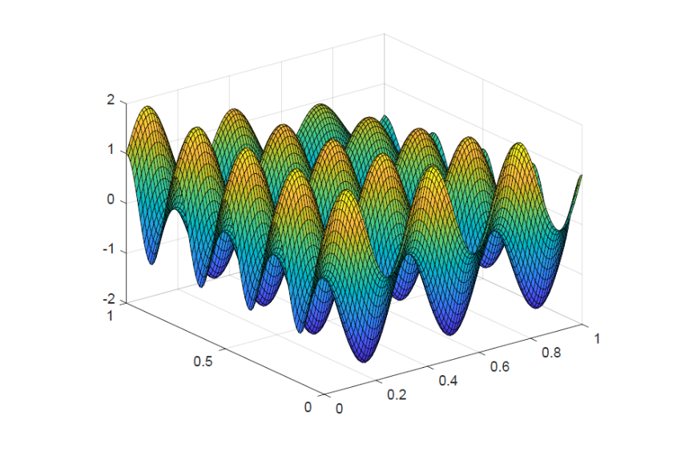

# Computational Methods for Economists, Econ-81360
**The Graduate Center, CUNY, Fall 2025**  
*Instructor: Lilia Maliar*  
**Due:** October 11, 2025, 11:59 pm

## Problem Set 2

In this problem set, we focus on integration methods.

---

### Problem 1

Consider the following integral:

$$
\int_0^{2\pi} e^{-x} \sin(10x) \, dx
$$

1. **(a)** Use integration by parts to approximate this integral, and interpret the resulting value as exact.
2. **(b)** Code the Gauss-Chebyshev integration method by using tabulated values of Chebyshev nodes and weights (consider up to the fifth order polynomials). Evaluate the integral.
3. **(c)** Code the Trapezoid and Simpson’s integration rules to evaluate the integral. How does the accuracy depend on the number of subperiods considered?
4. **(d)** Use built-in MATLAB functions (`quad`, `integral`, `trapz`, etc.) to compare with the results obtained above. Try different tolerance parameters in those built-in MATLAB functions.

---

### Problem 2

Consider the following integral:

$$
\int_0^1 \int_0^1 e^{-xy} (\sin 6\pi x + \cos 8\pi y) \, dx \, dy
$$

The integrand looks like:



*(This graph of the integrand can be generated with:)*

```matlab
f = @(x, y) exp(-x .* y) .* (sin(6 * pi * x) + cos(8 * pi * y));
[X, Y] = meshgrid(0:0.01:1, 0:0.01:1);
Z = f(X, Y); surf(X, Y, Z)
```

1. **(a)** Code the Gauss-Chebyshev integration method in 2 dimensions and use it to compute the above integral under different orders of Chebyshev polynomials (up to degree 5).
2. **(b)** Code the Trapezoid rule in 2 dimensions and use it to compute the above integral under different number of subperiods.
3. **(c)** Use Monte Carlo integration method to compute the integral, $\int_a^b f(x) \, dx = \frac{1}{T} \sum_{i=1}^T f(x_i)$. For this purpose, use $T = 10,000$ sampled points. What do you observe when you sample different points?
4. **(d)** Compare the accuracy of the above three integration methods to that produced by the MATLAB function `dblquad`.

---

### Problem 3

Consider the same model as in Problem Set 1:

$$
\max_{\{c_t, k_{t+1}\}_{t=0}^\infty} E_0 \left[ \sum_{t=0}^\infty \beta^t u(c_t) \right],
$$

$$
\text{s.t. } c_t + k_{t+1} = (1 - \delta) k_t + A z_t k_t^\alpha,
$$

$$
\ln z_t = \rho \ln z_{t-1} + \epsilon_t,
$$

$$
\epsilon_t \sim N(0, \sigma^2),
$$

$$
k_0, z_0 > 0 \text{ are given},
$$

where $k$, $c$ and $z$ are capital, consumption and productivity level, respectively; $\beta \in (0, 1)$; $\delta \in [0, 1]$; $\alpha \in (-1, 1)$; $\rho \geq 0$; the utility and production functions, $u$ and $f$, respectively, are strictly increasing, continuously differentiable and strictly concave. The primes on variables denote next-period values, and $E [V (k', z')]$ is an expectation conditional on state $(k, z)$.

where $u$ is the utility function, which is assumed to be strictly increasing and concave; $\beta \in (0, 1)$ is the discount factor; $\delta \in [0, 1]$ is the depreciation rate; $c_t$ and $k_{t+1}$ are consumption and end-of-period capital, respectively; $A$ is a normalizing constant in output. Parameterize the model in the standard way by assuming $u (c) = \frac{c^{1-\gamma}}{1-\gamma}$, $\gamma=1$, $\alpha=0.36$, $\delta=0.025$, $\beta=0.99$, $\rho=0.95$ and $\sigma=0.01$.

Use the same code that was provided in Problem Set 1 as a benchmark. Among the seven solution methods available in the provided code, you should choose Method 7, which is an Euler equation method parameterizing the capital decision function. The description of such an algorithm is provided in Appendix A7 of the paper “Matlab, Python, Julia: What to Choose in Economics?” by Coleman et al. (2019).

In that problem, the integration is implemented using Gauss-Hermite quadrature.

1. **(a)** Replace the provided integration routine `GH_Quadrature.m` with a MATLAB’s built-in function `quad`.
2. **(b)** Now, to approximate the conditional expectation function, use Monte Carlo integration method with 10 nodes. Namely, in each grid point, draw 10 random shocks and compute the average in the right side of the Euler equation.
3. **(c)** Approximate the conditional expectation function by considering two monomial rules described in Judd, Maliar and Maliar (2011) (see the paper and the routines are attached).
4. **(d)** What can you say about the accuracy of the model’s solutions when (a)-(c), as well as the original routine `GH_Quadrature.m`, are used.
